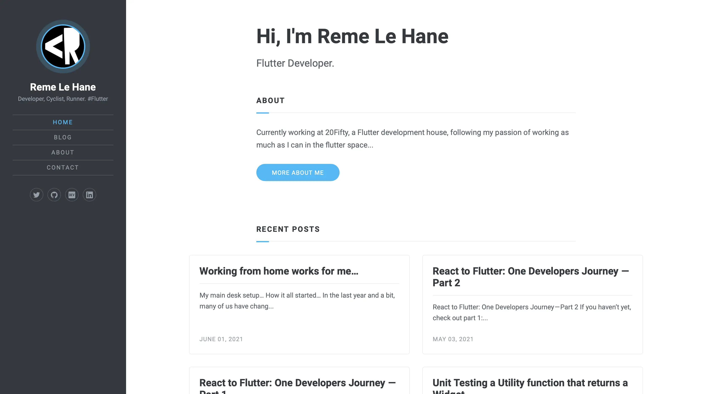

# Reme Le Hane

My personal website/blog

[Website](https://www.remelehane.dev) | [LinkedIn](https://www.linkedin.com/in/remelehane/) | [Twitter](https://twitter.com/RemeJuan) | [Medium](https://remelehane.medium.com/)

Some recent articles:
- [Working from home works for me…](https://remelehane.medium.com/working-from-home-it-works-for-me-2904c9edc0a4)
- [React to Flutter: One Developers Journey — Part 1](https://itnext.io/react-to-flutter-one-developers-journey-part-1-f101443bff82)
- [React to Flutter: One Developers Journey — Part 2](https://itnext.io/react-to-flutter-one-developers-journey-part-2-10ac6919f580)

